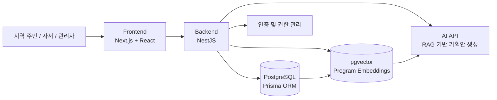
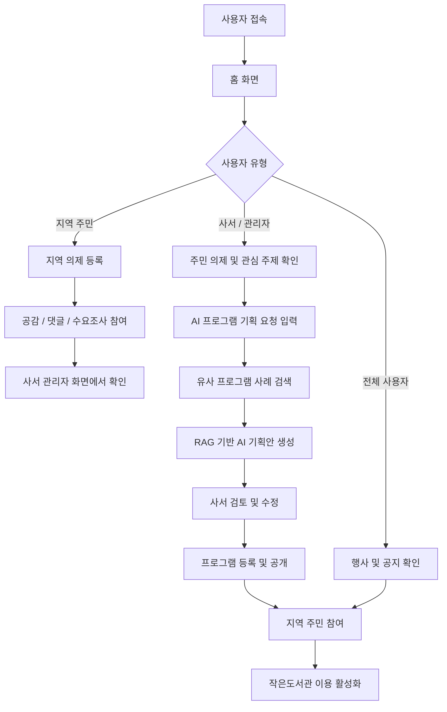

# 모이라: 모두가 이어지는 라이브러리

> 작은도서관과 지역 주민을 연결하고, AI 기반 프로그램 기획을 지원하는 지역 커뮤니티 플랫폼

## 1. 프로젝트 소개

**모이라: 모두가 이어지는 라이브러리**는 작은도서관의 운영 지원과 지역 주민 참여 활성화를 목표로 하는 AI 기반 웹 플랫폼입니다.

작은도서관은 지역 주민의 문화·교육 활동과 커뮤니티 형성을 지원하는 생활밀착형 공간이지만, 실제 운영 과정에서는 낮은 이용률, 홍보 부족, 제한적인 프로그램 운영, 사서의 업무 과중 등의 문제가 존재합니다.

모이라는 이러한 문제를 해결하기 위해 주민이 지역 의제와 프로그램 아이디어를 제안할 수 있는 공간을 제공하고, AI가 이를 분석하여 사서의 프로그램 기획을 지원합니다. 또한 금정구 작은도서관의 행사와 공지 정보를 통합 제공하여 주민이 가까운 도서관의 참여 기회를 쉽게 확인할 수 있도록 합니다.

---

## 2. 개발 배경 및 필요성

작은도서관은 단순한 도서 대출 공간을 넘어 독서 활동, 문화 프로그램, 정보활용교육 등 다양한 서비스를 제공하며 지역 공동체 형성에 기여하고 있습니다.

그러나 실제 운영 과정에서는 다음과 같은 문제가 나타나고 있습니다.

* 작은도서관에 대한 지역 주민의 인식 부족
* 낮은 이용률과 부족한 홍보
* 제한적인 프로그램 운영
* 사서 및 운영 인력 부족
* 지역 주민 수요를 반영한 프로그램 기획의 어려움
* 지역 단위 통합 플랫폼 부재

특히 작은도서관은 소규모 인력으로 운영되는 경우가 많아 사서가 행정 업무, 프로그램 기획, 민원 응대, 정보서비스 운영 등을 동시에 담당해야 하는 부담이 있습니다.

또한 주민들은 집 근처 작은도서관에서 어떤 프로그램이 운영되는지, 어떤 참여 기회가 있는지 쉽게 확인하기 어렵습니다.

이러한 문제는 작은도서관의 지역 커뮤니티 기능 약화와 문화·정보 접근성 격차로 이어질 수 있습니다. 이에 따라 본 프로젝트는 작은도서관 운영을 지원하고 주민 참여를 활성화할 수 있는 웹 기반 플랫폼을 기획하게 되었습니다.

---

## 3. 개발 목표

본 프로젝트의 목표는 AI와 웹 플랫폼을 활용하여 작은도서관의 운영 효율을 높이고, 지역 주민이 프로그램 기획 과정에 참여할 수 있는 지역 커뮤니티 서비스를 구축하는 것입니다.

주요 목표는 다음과 같습니다.

### 3.1. AI 기반 프로그램 기획 지원

* 사서가 입력한 기획 요청과 주민 의제를 바탕으로 프로그램 기획안 초안을 생성합니다.
* 기존 작은도서관 프로그램 사례를 참고하여 현실적인 기획안을 제공합니다.
* 사서의 프로그램 기획 업무 부담을 줄이고, 지역 수요를 반영한 프로그램 운영을 지원합니다.

### 3.2. 지역 주민 참여 활성화

* 주민이 우리 동네에 필요한 프로그램이나 해결해야 할 문제를 직접 제안할 수 있도록 합니다.
* 제안된 의제에 대해 공감, 댓글, 수요조사 등으로 의견을 표현할 수 있도록 합니다.
* 사서가 주민의 관심사와 수요를 쉽게 파악할 수 있도록 지원합니다.

### 3.3. 작은도서관 정보 접근성 향상

* 금정구 내 작은도서관의 행사 및 공지 정보를 한곳에서 확인할 수 있도록 합니다.
* 프로그램 일정, 장소, 대상, 신청 링크 등 참여에 필요한 정보를 제공합니다.
* 주민이 가까운 작은도서관의 프로그램에 쉽게 접근할 수 있도록 돕습니다.

---

## 4. 주요 사용자

본 서비스의 주요 사용자는 **지역 주민**과 **사서/관리자**입니다.

### 4.1. 지역 주민

지역 주민은 작은도서관에서 다루었으면 하는 지역 문제나 프로그램 아이디어를 제안할 수 있습니다.

주요 기능은 다음과 같습니다.

* 지역 의제 및 프로그램 아이디어 등록
* 다른 주민의 제안 확인
* 게시글 공감 및 댓글 작성
* AI 기획안에 대한 사전 수요조사 참여
* 작은도서관 행사 및 공지사항 확인
* 프로그램 상세 정보 및 신청 링크 확인

### 4.2. 사서 / 관리자

사서와 관리자는 주민이 등록한 의제를 확인하고, AI 분석 결과를 바탕으로 프로그램을 기획할 수 있습니다.

주요 기능은 다음과 같습니다.

* 주민 의제 확인 및 관리
* 인기 의제 및 관심 주제 확인
* AI 기반 프로그램 기획안 생성
* 생성된 기획안 수정 및 관리
* 프로그램 및 공지사항 등록·수정·삭제
* 수요조사 결과 확인
* 게시글 및 댓글 관리

---

## 5. 기존 서비스 대비 차별성

기존 작은도서관 관련 서비스는 주로 도서관 검색, 기본 정보 제공, 행사 안내에 초점을 두고 있습니다. 반면 모이라는 작은도서관의 실제 운영을 지원하고, 주민 참여를 프로그램 기획 과정과 연결하는 운영 지원형 플랫폼입니다.

| 구분     | 기존 작은도서관 서비스            | 모이라                        |
| ------ | ----------------------- | -------------------------- |
| 서비스 범위 | 전국 단위 정보 제공 중심          | 금정구 지역 밀착형 운영 지원           |
| 주요 기능  | 도서관 검색, 행사 안내, 운영 사례 제공 | AI 프로그램 기획, 지역 의제 수집, 수요조사 |
| 운영 지원  | 제한적                     | 사서의 프로그램 기획 업무 지원          |
| 주민 참여  | 단순 정보 확인 중심             | 의제 제안, 공감, 댓글, 수요조사 참여     |
| 데이터 활용 | 정적 정보 제공 중심             | 주민 수요와 기존 프로그램 사례 기반 AI 활용 |
| 활용 대상  | 이용자 중심                  | 사서와 주민이 함께 활용              |

모이라는 단순 정보 제공을 넘어 다음과 같은 차별성을 가집니다.

* AI 기반 프로그램 기획안 생성
* 주민 의제 및 관심 주제 수집
* 금정구 작은도서관 중심의 지역 밀착형 서비스
* 행사 및 공지 정보 통합 제공
* 수요조사를 통한 프로그램 기획 보완
* 사서와 주민이 함께 활용하는 통합 플랫폼

---

## 6. 사회적 가치

모이라는 작은도서관을 중심으로 지역 주민과 사서가 함께 참여하는 지역 커뮤니티 플랫폼을 지향합니다.

본 프로젝트를 통해 다음과 같은 사회적 가치를 실현하고자 합니다.

### 6.1. 지역 주민 참여 확대

주민이 직접 지역 의제와 프로그램 아이디어를 제안할 수 있도록 지원합니다. 이를 통해 지역 문제 해결 과정에 주민이 참여할 수 있는 구조를 마련합니다.

### 6.2. 작은도서관 운영 지원

AI 기반 프로그램 기획 기능을 통해 사서의 업무 부담을 완화합니다. 주민 수요를 반영한 문화·교육 프로그램 운영을 지원합니다.

### 6.3. 문화·정보 접근성 향상

주민이 가까운 작은도서관의 프로그램과 참여 기회를 쉽게 확인할 수 있도록 합니다. 이를 통해 지역 내 문화·교육 접근성 격차 완화에 기여합니다.

### 6.4. 지역사회 협력 모델 구축

금정구 작은도서관 시범 운영을 시작으로 부산 지역 전체 작은도서관으로 확장하는 것을 목표로 합니다. 지역 기관과의 협력을 통해 지속 가능한 지역사회 참여 모델을 구축합니다.

---

## 7. 시스템 구성도



시스템은 크게 프론트엔드, 백엔드, 데이터베이스, 벡터 검색, AI 기능 모듈로 구성됩니다.

### Frontend

사용자 화면을 제공합니다.
지역 의제 등록, 프로그램 조회, 로그인, 관리자 기능 등의 UI를 담당합니다.

### Backend

사용자 요청을 처리하고 데이터베이스 및 AI 기능과 연동합니다.
인증, 게시판, 프로그램, 의제, 수요조사, AI 기획안 관련 API를 제공합니다.

### Database

사용자 정보, 지역 의제, 프로그램 정보, 게시글, 댓글, 수요조사 데이터를 저장합니다.

### Vector Search

기존 프로그램 사례의 텍스트 정보를 임베딩하여 저장하고, 사서의 기획 요청과 유사한 프로그램 사례를 검색합니다.

### AI 기능

검색된 기존 프로그램 사례와 주민 의제를 바탕으로 프로그램 기획안 초안을 생성합니다.
생성된 기획안은 사서가 검토하고 수정할 수 있는 초안 형태로 제공됩니다.

---

## 8. 사용 기술

### Frontend

| 기술                 | 설명                    |
| ------------------ | --------------------- |
| TypeScript         | 정적 타입 기반 프론트엔드 개발     |
| Next.js App Router | 페이지 라우팅 및 웹 애플리케이션 구성 |
| React              | 컴포넌트 기반 UI 개발         |
| CSS / CSS Module   | 화면 스타일링               |

### Backend

| 기술           | 설명              |
| ------------ | --------------- |
| TypeScript   | 정적 타입 기반 백엔드 개발 |
| NestJS       | 서버 애플리케이션 프레임워크 |
| Prisma ORM   | 데이터베이스 ORM      |
| PostgreSQL   | 관계형 데이터베이스      |
| pgvector     | 프로그램 사례 벡터 검색   |
| LangChain.js | RAG 기반 AI 기능 구성 |

### Collaboration / DevOps

| 도구                   | 설명             |
| -------------------- | -------------- |
| GitHub               | 코드 저장소 및 협업    |
| GitHub Issues        | 기능 단위 작업 관리    |
| GitHub Pull Requests | 코드 리뷰 및 병합 관리  |
| GitHub Projects      | 프로젝트 진행 상황 관리  |
| GitHub Actions       | CI/CD 워크플로우 관리 |
| VS Code              | 개발 환경          |
| Figma                | UI/UX 설계       |

### AI Tools

| 도구             | 활용 목적                               |
| -------------- | ----------------------------------- |
| GitHub Copilot | 코드 작성, 리팩토링, 반복 코드 작성 보조            |
| ChatGPT        | 기능 명세 작성, README 작성, 이슈 및 PR 문서화 보조 |
| Gemini         | 아이디어 구체화 및 문서 작성 보조                 |
| Claude         | 기획 문서 검토 및 개발 문서 정리 보조              |

---

## 9. 전체 시스템 흐름



---

## 10. 주요 기능

### 10.1. 홈 화면

* 사용자는 서비스 소개와 주요 기능을 확인할 수 있습니다.
* 작은도서관 안내, 프로그램 정보, 공지사항, 지역 의제 요약 영역을 확인할 수 있습니다.
* 로그인, 회원가입, 지역 의제, 행사 정보 등 주요 페이지로 이동할 수 있습니다.

### 10.2. 로그인 및 권한 관리

* 일반 사용자와 사서/관리자 계정을 구분합니다.
* 사서 및 관리자 계정은 관리자 기능에 접근할 수 있습니다.
* 실제 인증 API 연동은 추후 구현 예정입니다.

### 10.3. 지역 의제 등록

* 지역 주민은 우리 동네에 필요한 프로그램이나 해결해야 할 문제를 작성할 수 있습니다.
* 제목, 내용, 태그, 공개 여부 등의 정보를 입력할 수 있습니다.
* 등록된 의제는 관리자 화면에서 확인할 수 있습니다.

### 10.4. 공감 및 댓글

* 주민은 다른 사용자가 등록한 의제에 공감하거나 댓글을 작성할 수 있습니다.
* 일정 공감 수 이상을 받은 게시글은 인기 의제로 분류됩니다.
* 사서는 인기 의제를 통해 주민 요구를 쉽게 파악할 수 있습니다.

### 10.5. AI 프로그램 기획안 생성

* 사서가 프로그램 기획 요청을 입력하면 AI가 기획안 초안을 생성합니다.
* 기존 작은도서관 프로그램 사례와 주민 의제를 참고하여 기획안을 작성합니다.
* 기획안에는 다음 항목이 포함됩니다.

  * 프로그램명
  * 기획 의도
  * 대상
  * 운영 기간
  * 회차별 활동 내용
  * 준비물
  * 홍보문
  * 기대 효과
  * 운영 시 유의점

### 10.6. AI 기획안 수정

* 생성된 기획안은 사서가 검토하고 수정할 수 있습니다.
* 전체 재생성뿐 아니라 특정 항목만 선택적으로 수정할 수 있도록 설계합니다.
* 예를 들어 “홍보문만 더 친근하게 수정”, “준비물만 다시 정리”와 같은 부분 수정이 가능합니다.

### 10.7. AI 기획안 사전 수요조사

* 사서가 생성한 프로그램 기획안 초안을 게시하면 주민은 공감 또는 투표 방식으로 참여 의사를 표현할 수 있습니다.
* 사서는 수요조사 결과를 바탕으로 프로그램 기획안을 보완할 수 있습니다.

### 10.8. 행사 및 공지 정보 제공

* 금정구 공공예약서비스와 금정구 작은도서관 공지사항에 공개된 행사 정보를 제공합니다.
* 프로그램명, 대상, 일정, 장소, 모집 인원, 안내사항, 출처, 공식 신청 링크 등을 확인할 수 있습니다.

### 10.9. 프로그램 및 게시판 관리

* 관리자는 도서관 프로그램과 공지사항을 등록, 수정, 삭제할 수 있습니다.
* 사용자는 프로그램 목록 및 상세 정보를 확인할 수 있습니다.
* 관리자는 게시글의 공개 여부, 인기 의제 여부, 부적절한 댓글 및 게시글을 관리할 수 있습니다.

---

## 11. 기능 명세 요약

| 기능             | 사용자     | 설명                           | 상태    |
| -------------- | ------- | ---------------------------- | ----- |
| 회원가입 / 로그인     | 전체 사용자  | 사용자 인증 및 권한 구분               | 개발 예정 |
| 홈 화면           | 전체 사용자  | 서비스 소개 및 주요 정보 제공            | 개발 중  |
| 지역 의제 등록       | 지역 주민   | 지역 문제 및 프로그램 아이디어 제안         | 개발 예정 |
| 공감 / 댓글        | 지역 주민   | 다른 주민의 의제에 의견 표현             | 개발 예정 |
| 의제 관리          | 사서, 관리자 | 등록된 의제 확인, 수정, 삭제            | 개발 예정 |
| AI 프로그램 기획안 생성 | 사서, 관리자 | 선택 의제 및 기획 요청 기반 프로그램 기획안 생성 | 개발 예정 |
| AI 기획안 부분 수정   | 사서, 관리자 | 생성된 기획안의 특정 항목 수정            | 개발 예정 |
| 사전 수요조사        | 지역 주민   | AI 기획안에 대한 관심도 및 참여 의사 표현    | 개발 예정 |
| 행사 및 공지 정보 제공  | 전체 사용자  | 작은도서관 행사 정보 확인               | 개발 예정 |
| 프로그램 관리        | 사서, 관리자 | 프로그램 등록, 수정, 삭제              | 개발 예정 |
| 게시판 관리         | 사서, 관리자 | 게시글 및 댓글 관리                  | 개발 예정 |

---

## 12. 디렉토리 구조

```bash
PNUAI-A-02-POTG/
├── .github/
│
├── apps/
│   ├── backend/
│   │   ├── src/
│   │   │   ├── data/
│   │   │   │   └── mockData.ts
│   │   │   ├── routes/
│   │   │   └── index.ts
│   │   ├── .gitkeep
│   │   ├── package-lock.json
│   │   ├── package.json
│   │   ├── README.md
│   │   └── tsconfig.json
│   │
│   └── frontend/
│       ├── src/
│       │   └── app/
│       │       ├── globals.css
│       │       ├── layout.tsx
│       │       └── page.tsx
│       ├── .gitignore
│       ├── .gitkeep
│       ├── eslint.config.mjs
│       ├── next-env.d.ts
│       ├── next.config.ts
│       ├── package-lock.json
│       ├── package.json
│       ├── README.md
│       └── tsconfig.json
│
├── docs/
│   └── .gitkeep
│
├── packages/
│   └── types/
│       └── .gitkeep
│
├── CONTRIBUTING.md
└── README.md
```

---

## 13. AI 도구 활용

본 프로젝트는 기획, 설계, 개발, 문서화 과정 전반에서 생성형 AI와 AI 코딩 도구를 활용합니다.

### 13.1. 기획 및 요구사항 분석

* 작은도서관 운영 문제와 사용자 요구사항을 정리하는 데 AI를 활용했습니다.
* 지역 주민과 사서/관리자의 사용자 시나리오를 구체화했습니다.
* 기능 요구사항을 GitHub Issue 단위로 분리하는 데 도움을 받았습니다.

### 13.2. UI/UX 설계

* Figma 및 AI 도구를 활용하여 주요 화면 흐름과 와이어프레임을 구상했습니다.
* 홈 화면, 로그인 화면, 지역 의제 등록 화면, 관리자 화면 등의 UI 구조를 설계했습니다.
* 사용자가 이해하기 쉬운 문구와 입력 항목을 검토했습니다.

### 13.3. 프론트엔드 / 백엔드 개발

* GitHub Copilot을 활용하여 반복적인 코드 작성과 컴포넌트 구조 생성을 보조했습니다.
* TypeScript 기반 코드 작성, 리팩토링, 오류 수정, 주석 작성 등에 활용했습니다.
* 프론트엔드에서는 Next.js와 React 기반 화면 컴포넌트 구현을 보조했습니다.
* 백엔드에서는 NestJS, Prisma 기반 API 및 데이터베이스 연동 코드 작성을 보조할 예정입니다.

### 13.4. AI 기능 구현

* LangChain.js를 활용하여 RAG 기반 프로그램 기획안 생성 구조를 설계합니다.
* 기존 프로그램 사례를 임베딩하여 유사 프로그램 검색에 활용합니다.
* OpenAI API 또는 Gemini API를 활용하여 프로그램 기획안 초안을 생성합니다.

### 13.5. 테스트 데이터 생성

* 실제 도서관 데이터가 충분히 확보되기 전까지 테스트용 데이터를 생성하는 데 AI를 활용할 예정입니다.
* 가상의 지역 의제, 관심 주제, 수요조사 결과, 프로그램 정보를 생성하여 기능 테스트에 활용합니다.

### 13.6. 문서화 및 협업

* README, Issue, Pull Request 문서 작성에 AI를 활용했습니다.
* 팀원 간 작업 범위를 명확히 하기 위해 기능 단위 체크리스트와 PR 템플릿을 정리했습니다.

---

## 14. 설치 및 실행 방법

### 14.1. 필수 설치 프로그램

프로젝트 실행을 위해 다음 프로그램이 필요합니다.

* Node.js
* npm
* Git
* VS Code

---

### 14.2. 프로젝트 클론

```bash
git clone https://github.com/PNU-2026-AI-Hackathon/pnuai-a-02-potg.git
cd pnuai-a-02-potg
```

---

### 14.3. 프론트엔드 실행

```bash
cd apps/frontend
npm install
npm run dev
```

실행 후 브라우저에서 아래 주소로 접속합니다.

```txt
http://localhost:3000
```

---

### 14.4. 백엔드 실행

```bash
cd apps/backend
npm install
npm run start:dev
```

---

### 14.5. 환경 변수 설정

프로젝트 루트 또는 백엔드 디렉토리에 `.env` 파일을 생성하고 다음 값을 설정합니다.

```env
DATABASE_URL=
AI_API_KEY=
JWT_SECRET=
```

---

## 15. 소개 및 시연 영상

* 소개 영상: TODO
* 시연 영상: TODO
* YouTube URL: TODO

프로젝트 소개 동영상은 교육원 메일로 제출한 후, 센터에서 부여받은 YouTube URL을 기재할 예정입니다.

---

## 16. 팀 소개

### Team POTG

**POTG**는 **Programmers Of The Geumjeong**의 약자로, 금정구 작은도서관 문제 해결을 목표로 모인 팀입니다.

| 이름  | 역할               | 담당 업무                        |
| --- | ---------------- | ---------------------------- |
| 박현아 | 팀장 / 프론트엔드 / 백엔드 | 프로젝트 관리, 프론트엔드 및 백엔드 개발      |
| 권아영 | 기획 / 디자인         | 서비스 기획, 작은도서관 요구사항 분석, UI 기획 |
| 윤상현 | 프론트엔드 / 백엔드      | 프론트엔드 및 백엔드 개발, 기능 구현        |
| 양현서 | 기획 / UX/UI       | 사용자 경험 설계, 화면 구성, 기획 보조      |

---

## 17. 해커톤 참여 후기

### 박현아

TODO

### 권아영

TODO

### 윤상현

TODO

### 양현서

TODO
