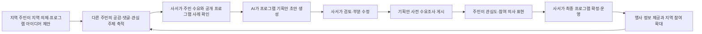
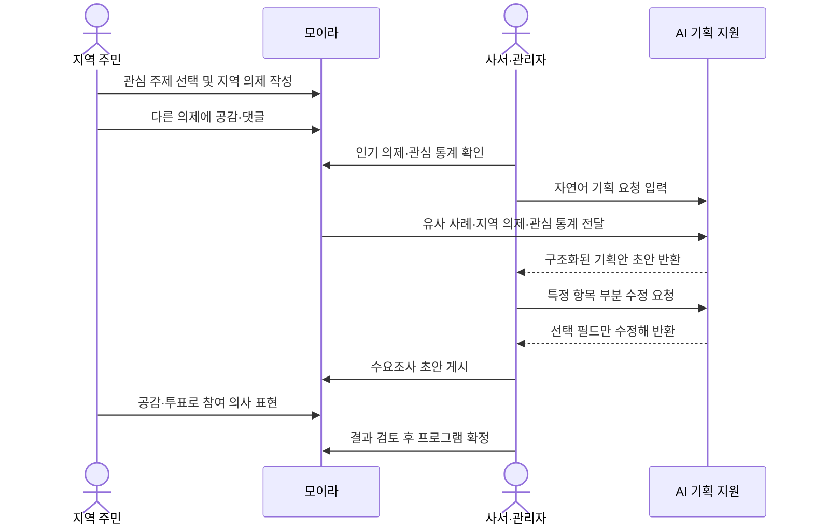
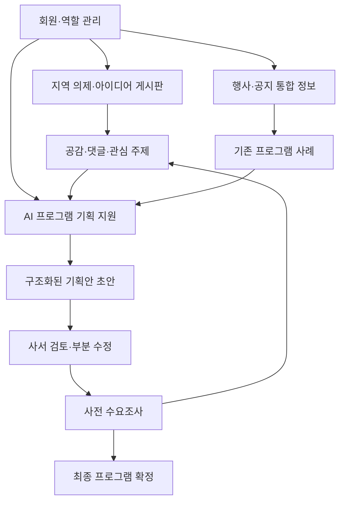
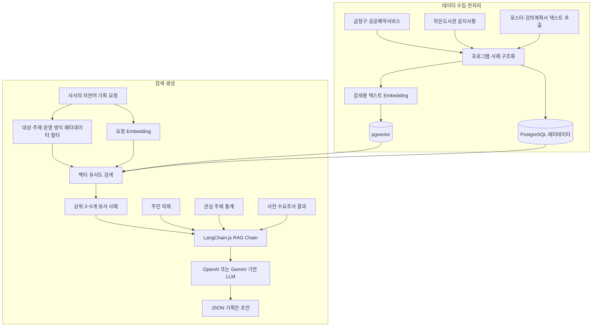
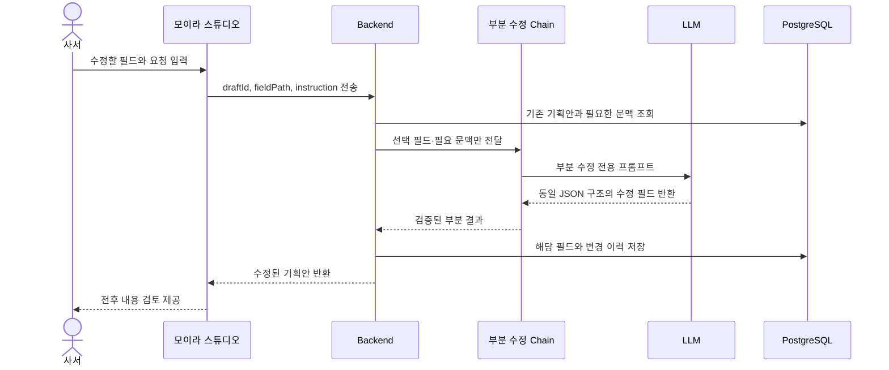
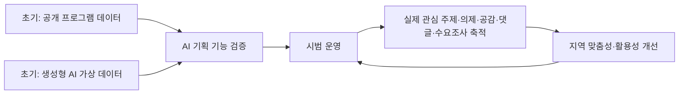
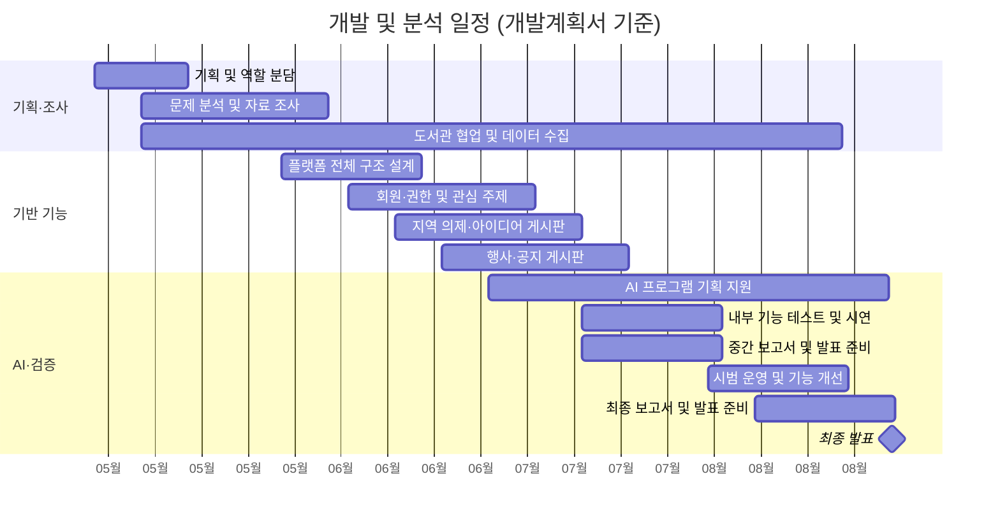
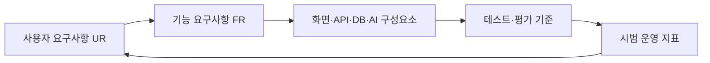

# 모이라: 모두가 이어지는 라이브러리 - 개발계획서

> **문서 성격**
>
> 이 문서는 제7회 PNU AI 창의융합 해커톤 융합트랙 개발계획서인 `수정개발계획서_융합트랙_POTG.pdf`를 GitHub에서 관리하기 좋은 형태로 재구성한 원본 설계 명세서(Original Planning Master Specification)다. 원문 계획의 배경, 요구사항, 기술 개발 계획, 일정, 활용 계획과 팀 역량을 가능한 한 충실하게 보존하고, AI 에이전트가 문맥과 요구사항의 관계를 파악할 수 있도록 용어집, 추적성 매트릭스와 Mermaid 도식을 추가했다.
>
> **Note**
>
> 본 문서는 개발계획서 기준이다. 계획서에는 백엔드 기술로 NestJS가 명시되어 있으나 현재 구현은 Express 기반이다. 현재 MVP 범위와 실제 구현 상태는 [`.ai/CURRENT_SCOPE.md`](../.ai/CURRENT_SCOPE.md), [`.ai/IMPLEMENTATION_STATUS.md`](../.ai/IMPLEMENTATION_STATUS.md), [`.ai/ARCHITECTURE.md`](../.ai/ARCHITECTURE.md)를 우선한다. OpenAI API, RAG, LangChain.js, pgvector 역시 향후 계획이며 현재 구현으로 간주하지 않는다.

`DEVELOPMENT_PLAN.md`는 원본 개발계획을 보존하는 문서이며, 현재 구현 내용과 범위는 `.ai/CURRENT_SCOPE.md`와 `.ai/IMPLEMENTATION_STATUS.md`를 우선한다.

## 문서 메타데이터

| 항목 | 내용 |
|---|---|
| 프로젝트명 | 모이라: 모두가 이어지는 라이브러리 |
| 팀명 | POTG (Programmers Of The Geumjeong) |
| 트랙 | 융합트랙 (PAI+X) |
| 서비스 형태 | 웹 |
| 대상 지역 | 부산광역시 금정구 |
| 핵심 사용자 | 지역 주민, 작은도서관 사서 및 관리자 |
| 원문 계획 기간 | 5월~8월, 약 4개월 |
| 문서 원천 | `수정개발계획서_융합트랙_POTG.pdf` |

## 문서 해석 원칙

1. 이 문서는 원 개발계획의 의도와 내용을 기록한다.
2. 계획과 현재 코드가 다를 때 계획을 소급 수정하지 않고 Note로 차이를 알린다.
3. 개인정보 보호를 위해 원문 신청서의 전화번호, 생년월일, 학번, 개인 이메일과 서명은 전재하지 않는다.
4. 행정 신청 절차, 개인정보 제공 동의문과 출품 서약은 제품 개발계획이 아니므로 이 문서의 본문 범위에서 제외한다.
5. 팀원 이름과 프로젝트 역할, 프로젝트 수행 역량은 공개 가능한 프로젝트 정보로 정리한다.

## 목차

- [1. 프로젝트 개요](#1-프로젝트-개요)
- [2. 프로젝트 배경](#2-프로젝트-배경)
- [3. 필요성과 기대효과](#3-필요성과-기대효과)
- [4. 사용자 요구사항](#4-사용자-요구사항)
- [5. 기능 요구사항](#5-기능-요구사항)
- [6. AI 기술 개발 계획](#6-ai-기술-개발-계획)
- [7. 검증 계획](#7-검증-계획)
- [8. 개발 환경](#8-개발-환경)
- [9. 생성형 AI 활용 계획](#9-생성형-ai-활용-계획)
- [10. 기존 서비스 비교](#10-기존-서비스-비교)
- [11. 개발 일정](#11-개발-일정)
- [12. 활용 계획](#12-활용-계획)
- [13. 팀 구성과 보유 역량](#13-팀-구성과-보유-역량)
- [14. 요구사항 추적성 매트릭스](#14-요구사항-추적성-매트릭스)
- [15. Glossary](#15-glossary)
- [16. 참고문헌](#16-참고문헌)

# 1. 프로젝트 개요

## 1.1 프로젝트 정의

**모이라: 모두가 이어지는 라이브러리**는 작은도서관 운영 지원과 주민 참여 활성화를 위한 AI 기반 통합 커뮤니티 플랫폼이다. 주민이 제안한 지역 의제와 관심사를 AI가 분석·분류하여 사서의 프로그램 기획을 지원하고, 행사 정보 제공과 소통 기능을 통해 주민과 도서관을 연결하는 지역밀착형 서비스를 제공하는 것을 목적으로 한다.

모이라는 단순한 도서관 검색 또는 행사 안내 서비스가 아니다. 주민이 생활 속 문제와 프로그램 아이디어를 제안하고, 이웃이 공감과 댓글로 의견을 보태며, 사서가 축적된 지역 수요와 기존 프로그램 사례를 활용해 실제 프로그램을 기획하는 순환 구조를 지향한다.

## 1.2 핵심 목표

- 금정구 내 작은도서관의 행사와 공지 정보를 한곳에서 제공한다.
- 주민이 지역 의제와 프로그램 아이디어를 쉽게 제안하고 토론하게 한다.
- 주민 관심 주제와 수요조사 결과를 도서관 프로그램 기획에 연결한다.
- 공개된 기존 프로그램 사례를 검색하고 AI가 프로그램 기획안 초안을 생성하게 한다.
- 사서가 AI 초안을 검토하고 항목별로 수정한 뒤 최종 의사결정을 내리게 한다.
- 작은도서관의 운영 효율과 주민 참여, 지역 커뮤니티 기능을 함께 높인다.

## 1.3 핵심 사용자 흐름



## 1.4 계획 기준 기술 구성

| 영역 | 개발계획서 기준 |
|---|---|
| Frontend | TypeScript, Next.js App Router, React |
| Backend | TypeScript, NestJS |
| Database | PostgreSQL, Prisma ORM |
| AI 파이프라인 | OpenAI API 또는 Gemini API, LangChain.js, RAG |
| 벡터 검색 | PostgreSQL pgvector, Embedding 모델 |
| 개발·협업 | VS Code, GitHub, GitHub Projects/Actions, Figma |
| AI 코딩 도구 | GitHub Copilot, ChatGPT, Gemini, Claude, OpenAI Codex |

> **AI Note**
>
> 본 장은 개발계획서의 제품 목표를 설명한다. 현재 공식 기능명은 **모이라 스튜디오**이며, 현재 구현 기술과 기능 상태는 `.ai/CURRENT_SCOPE.md`와 `.ai/IMPLEMENTATION_STATUS.md`를 우선한다.

# 2. 프로젝트 배경

## 2.1 국내외 시장 현황

### 2.1.1 작은도서관의 역할

「도서관법」 제4조 제2항에 따르면 작은도서관은 주민의 참여와 자치를 기반으로 지역사회의 생활 친화적 도서관문화 향상을 목적으로 하는 공공도서관의 한 형태로 정의된다. 작은도서관은 단순한 도서 대출 기능을 넘어 지역 주민의 문화 향유와 평생학습을 지원하고 지역 커뮤니티를 연결하는 생활밀착형 문화공간으로 자리 잡고 있다.

문화체육관광부 작은도서관 서비스의 2026년 5월 6일 기준 정보에 따르면 전국에는 총 6,735개의 작은도서관이 운영되고 있으며, 부산광역시에는 444개가 운영 중이다. 금정구청 자료에 따르면 금정구에는 공립 작은도서관 20개 관과 사립 작은도서관 20개 관, 총 40개 관이 운영되고 있다.

금정구 작은도서관은 동화 읽어주기, 영어 학습, 글쓰기 프로그램 등 유아부터 초등학생과 성인까지 다양한 연령층을 대상으로 프로그램을 운영한다. 이러한 활동은 지역 주민의 문화 향유와 기초 정보 활용 역량 향상에 기여하며, 지역 커뮤니티 활성화의 기반이 된다.

## 2.2 문제점

### 2.2.1 낮은 인지도와 이용률

작은도서관이 다양한 문화·교육 서비스를 제공함에도 지역 주민의 인식 부족으로 이용률이 낮다. 부산의 작은도서관 수는 매년 증가하고 있지만, 2023년 전체 437개 관 중 절반 이상인 239개 관의 하루 평균 이용자가 10명 이하로 나타났다. 평일 오전 시간대의 낮은 이용률, 부족한 홍보, 제한적인 프로그램 운영 등이 주요 원인으로 지적된다.

지역 단위 통합 플랫폼이 없어 주민이 집 근처 도서관의 프로그램과 참여 기회를 충분히 접하기 어렵다는 점도 문제다. 행사와 공지가 개별 홈페이지나 공공예약서비스에 분산되어 있어 접근 비용이 높고, 주민의 관심사가 도서관 운영으로 이어지는 경로도 부족하다.

### 2.2.2 인력 부족과 사서 업무 과중

작은도서관을 포함한 공공도서관에서는 인력 부족에 따른 사서 업무 과중 문제가 나타난다. 사서는 기본 운영뿐 아니라 행정, 행사 기획과 진행, 민원 응대, 정보서비스 운영, 정보활용교육 등 다양한 업무를 수행한다. 부산 기장군 고촌어울림도서관과 내리새라도서관 사례처럼 사서 한 명이 이 업무를 모두 담당하는 경우도 있다.

특히 작은도서관은 공공도서관보다 소규모 인력과 제한된 예산으로 운영되는 경우가 많고, 단기 계약 인력이나 자원봉사 인력에 의존하는 사례도 있어 안정적인 인력 운영에 한계가 있다. 제한된 인력으로 행정과 프로그램 기획을 병행해야 하므로 주민 수요 파악과 지역 맞춤형 프로그램 기획에 어려움을 겪는다.

### 2.2.3 지역 커뮤니티 기능 약화

낮은 인지도와 인력 부족은 작은도서관의 안정적인 운영과 주민 대상 서비스 제공에 부정적인 영향을 미친다. 작은도서관이 지역 거점 커뮤니티로서 역할을 충분히 수행하지 못하면 주민의 문화·교육 프로그램 접근성이 낮아지고 지역 커뮤니티 기능도 약화될 수 있다. 이는 지역사회 안의 문화 격차와 정보 접근성 격차를 심화시키는 사회적 문제로 이어질 가능성이 있다.

## 2.3 프로젝트 착안

본 팀은 지역 주민의 작은도서관 이용을 활성화하면서 사서의 업무 부담을 완화할 서비스가 필요하다고 판단했다. AI를 활용한 프로그램 기획 지원과 주민 의견 수렴 기능이 작은도서관 운영 효율성 향상에 도움이 될 수 있다는 점에 착안해, 지역 주민과 도서관을 연결하는 웹 플랫폼 **모이라: 모두가 이어지는 라이브러리**를 기획했다.

> **AI Note**
>
> 현황 수치와 사례는 원 개발계획서에 인용된 시점의 자료다. 최신 통계로 자동 치환하지 말고, 갱신 시 출처와 기준일을 함께 변경해야 한다.

# 3. 필요성과 기대효과

## 3.1 필요성

작은도서관은 주민과 가장 가까운 생활권에서 사람을 연결하는 지역 커뮤니티 공간이라는 의의를 가진다. 누구나 무료로 정보에 접근하고 양질의 정보서비스를 이용할 수 있다는 공공도서관의 속성을 가지면서, 아파트 단지나 주택가 등 생활권 가까이에 위치해 접근성이 높다. 노년층이나 이동이 불편한 주민도 비교적 쉽게 이용할 수 있고, 일상에서 문화·교육과 정보서비스를 부담 없이 접할 수 있다.

작은도서관은 독서 활동, 문화 프로그램, 정보활용교육 등 다양한 프로그램을 운영하며 주민 간 교류와 커뮤니티 형성을 지원한다. 이는 문화 향유 기회 확대, 정보 격차 완화, 지역 공동체 활성화라는 사회적 가치로 이어진다. 그러나 낮은 이용률과 사서 업무 과중 때문에 이러한 역할을 충분히 수행하지 못하고 있으므로, 운영 지원과 주민 참여를 함께 해결하는 플랫폼이 필요하다.

## 3.2 서비스 구성

플랫폼은 크게 세 축으로 구성된다.

1. 주민 의제, 관심 주제, 기존 프로그램 사례를 바탕으로 AI가 프로그램 기획안 초안을 생성해 사서의 기획 업무를 지원한다.
2. 주민이 지역 의제와 관심사를 제안하고 공감, 댓글, 수요조사로 의견을 공유하게 한다.
3. 분산된 작은도서관 행사 정보를 통합 제공하고 게시판을 통해 주민과 도서관의 소통을 지원한다.

## 3.3 기대효과

### 3.3.1 작은도서관과 사서

AI 기반 프로그램 기획 지원으로 기획에 소요되는 시간과 업무 부담을 줄일 수 있다. 사서는 주민 의제, 관심 주제와 기존 사례를 반영한 초안을 토대로 효율적으로 프로그램을 기획하고, 지역 특성에 맞는 다양한 문화·교육 프로그램을 운영할 수 있다.

### 3.3.2 지역 주민

분산된 행사 정보를 한곳에서 확인해 문화·교육 프로그램에 대한 정보 접근성과 참여 기회를 확대할 수 있다. 주민은 지역 의제 제안, 공감, 댓글, 수요조사 참여를 통해 프로그램 운영 과정에 의견을 제시한다. 주민 관심과 수요가 반영된 프로그램은 이용자 만족도 향상에도 기여할 수 있다.

### 3.3.3 지역사회

주민이 지역 현안과 관심사를 공유하고 의견을 교환하며, 도서관은 이를 바탕으로 지역사회 요구를 반영한 프로그램을 운영한다. 작은도서관이 지역사회 소통 거점으로 기능함으로써 주민 참여와 공동체 의식이 강화될 것으로 기대한다.

| 관점 | 문제 | 기대 변화 | 확인 지표 예시 |
|---|---|---|---|
| 사서 | 기획·행정 업무 과중 | 기획 초안 작성 시간 단축 | 기획 소요 시간 감소율, AI 기획안 활용 건수 |
| 주민 | 행사 정보 분산, 의견 반영 경로 부족 | 정보 접근성과 참여 기회 확대 | 의제 등록 수, 수요조사 참여율 |
| 도서관 | 지역 수요 파악의 어려움 | 관심사 기반 프로그램 운영 | 수요 반영 건수, 실무자 평가 |
| 지역사회 | 커뮤니티 연결 약화 | 지역 의제 중심 소통 활성화 | 공감·댓글·참여 데이터, 만족도 |

> **AI Note**
>
> 기대효과는 계획 단계의 가설이다. 실제 효과로 표현하려면 시범 운영 지표와 사용자 조사 결과가 필요하다.

# 4. 사용자 요구사항

## 4.1 지역 주민

| ID | 사용자 요구사항 |
|---|---|
| UR-R01 | 내 주변, 특히 금정구 내 작은도서관에서 열리는 행사와 지역 소식을 한눈에 파악하고 싶다. |
| UR-R02 | 우리 동네에 필요한 프로그램 아이디어나 지역사회 의제를 복잡한 절차 없이 제안하고 싶다. |
| UR-R03 | 다른 이웃이 제안한 아이디어에 공감하거나 의견을 남기며 소통하고 싶다. |
| UR-R04 | 사서가 제안한 프로그램 기획안에 간단한 투표 또는 공감으로 참여 의사를 표현하고 싶다. |

## 4.2 사서와 관리자

| ID | 사용자 요구사항 |
|---|---|
| UR-L01 | 우리 도서관에 맞는 고품질 프로그램 기획안을 빠르게 생성하고 싶다. |
| UR-L02 | 주민이 제안한 지역 의제와 관심 주제로 실제 주민이 원하는 프로그램을 파악하고 싶다. |
| UR-L03 | 공식 모집 전에 주민의 관심도와 예상 수요를 확인하고 싶다. |
| UR-L04 | 금정구 작은도서관의 공개 프로그램 정보를 체계적으로 보고 기획 참고 자료로 활용하고 싶다. |

## 4.3 사용자 여정



> **AI Note**
>
> 사용자 요구사항은 목표 사용자 경험이며 모든 흐름이 현재 구현된 것은 아니다. 구현 여부는 요구사항 문구가 아니라 구현 상태 문서를 기준으로 판단한다.

# 5. 기능 요구사항

## 5.1 회원가입, 로그인과 권한

| ID | 요구사항 |
|---|---|
| FR-AUTH-01 | 일반 이용자는 지역 의제 작성, 댓글, 공감, 관심 주제 선택, 기획안 수요조사 참여 기능을 사용할 수 있어야 한다. |
| FR-AUTH-02 | 사서와 관리자 계정은 AI 프로그램 기획안 생성, 기획안 게시, 행사 정보 관리, 게시글 관리 기능을 사용할 수 있어야 한다. |
| FR-AUTH-03 | 비회원 또는 일반 이용자는 공개 행사 정보와 게시글을 열람할 수 있고, 의견 제안과 수요조사 참여가 필요할 때 회원가입할 수 있어야 한다. |
| FR-AUTH-04 | 역할에 따라 일반 사용자, 사서와 관리자의 기능 접근을 구분해야 한다. |

## 5.2 지역 의제와 프로그램 아이디어

| ID | 요구사항 |
|---|---|
| FR-ISSUE-01 | 게시글은 제목, 내용, 태그와 공개 여부를 포함해 작성할 수 있어야 한다. |
| FR-ISSUE-02 | 게시글에 댓글과 공감 기능을 제공해 주민이 의견을 남길 수 있어야 한다. |
| FR-ISSUE-03 | 일정 공감 수 이상을 받은 게시글을 인기 의제로 분류해 사서가 주민 요구를 쉽게 파악할 수 있어야 한다. |
| FR-ISSUE-04 | 관리자는 게시글과 의제를 검토하고 필요에 따라 수정 또는 삭제할 수 있어야 한다. |

## 5.3 AI 기반 프로그램 기획안 생성

| ID | 요구사항 |
|---|---|
| FR-AI-01 | 사서의 기획 요청, 주민 의제, 관심 주제와 기존 프로그램 사례를 바탕으로 기획안 초안을 생성해야 한다. |
| FR-AI-02 | 기획안에는 프로그램명, 대상, 목적, 운영 방식, 회차별 활동, 준비물, 홍보문, 기대 효과 등을 포함해야 한다. |
| FR-AI-03 | 생성 결과는 사서가 검토하고 수정할 수 있는 초안이어야 하며 최종 결정을 대신해서는 안 된다. |
| FR-AI-04 | 생성 결과를 구조화된 JSON으로 반환하고 항목별 표시·저장·수정이 가능해야 한다. |
| FR-AI-05 | 전체 재생성뿐 아니라 선택한 항목과 필요한 문맥만 전달하는 부분 수정 기능을 제공해야 한다. |

## 5.4 기획안 사전 수요조사

| ID | 요구사항 |
|---|---|
| FR-SURVEY-01 | 사서가 AI 기획안 초안을 게시하면 주민이 공감 또는 투표로 관심도와 참여 의사를 표현할 수 있어야 한다. |
| FR-SURVEY-02 | 사서는 수요조사 결과를 확인해 프로그램 기획안을 보완할 수 있어야 한다. |

## 5.5 프로그램과 게시판 관리

| ID | 요구사항 |
|---|---|
| FR-MGMT-01 | 관리자는 행사 정보, 지역 의제, AI 기획안과 수요조사 게시글을 등록·수정·삭제할 수 있어야 한다. |
| FR-MGMT-02 | 일반 사용자는 게시글을 등록·수정·삭제하고 댓글을 작성할 수 있어야 한다. |
| FR-MGMT-03 | 프로그램 목록과 상세 화면에 일정, 장소, 대상, 모집 인원과 공식 신청 링크를 표시해야 한다. |
| FR-MGMT-04 | 관리자는 공개 여부, 인기 의제 여부, 부적절한 댓글과 게시글을 관리할 수 있어야 한다. |

## 5.6 행사와 공지 정보

| ID | 요구사항 |
|---|---|
| FR-EVENT-01 | 금정구 공공예약서비스와 금정구 작은도서관 공지사항의 공개 행사 정보를 모이라 행사 게시판에 제공해야 한다. |
| FR-EVENT-02 | 행사 게시글에는 프로그램명, 대상, 일정, 장소, 모집 인원, 안내사항, 출처와 공식 신청 링크를 표시해야 한다. |

## 5.7 기능 관계



> **AI Note**
>
> 기능 요구사항은 개발계획서의 목표 범위다. 현재 게시판 최종 기준은 `/community/*`이며 `/board`와 `/api/posts`는 레거시 또는 초기 연동 실험이다.

# 6. AI 기술 개발 계획

## 6.1 전체 구조

핵심인 AI 기반 프로그램 기획 지원은 금정구 작은도서관의 공개 프로그램 데이터를 이용한 RAG(Retrieval-Augmented Generation) 구조로 설계한다. 계획서 기준 백엔드는 NestJS, AI 파이프라인은 LangChain.js로 구성한다. 수집한 프로그램 데이터는 PostgreSQL에 저장하고, 프로그램 설명 텍스트를 Embedding 모델로 벡터화해 PostgreSQL의 pgvector 확장으로 관리한다.

사서가 자연어로 요청하면 시스템은 기존 프로그램 데이터베이스에서 유사 사례를 검색한다. 검색 사례를 LLM 프롬프트의 참고 자료로 제공하고, OpenAI API 또는 Gemini API 기반 LLM이 기존 사례와 주민 수요 데이터를 반영한 기획안 초안을 생성한다.



> **Note**
>
> 위 구조는 계획안이다. 현재 저장소에는 pgvector 확장, LangChain.js 의존성, RAG 검색·임베딩·생성 파이프라인과 AI API 연동이 구현되어 있지 않다.

## 6.2 데이터 수집 및 전처리

### 6.2.1 수집 출처와 범위

금정구 공공예약서비스와 금정구 작은도서관 공지사항에 공개된 기존 프로그램 정보를 수집한다. 대상은 금정구 공식 웹사이트에서 공개적으로 확인할 수 있는 다음 정보로 한정한다.

- 프로그램명
- 대상
- 모집 인원
- 교육 시간과 교육 기간
- 장소
- 안내사항
- 활동 내용
- 준비물
- 포스터와 강의계획서
- 출처 URL

포스터나 강의계획서가 이미지 또는 문서인 경우 필요한 텍스트를 추출한다.

### 6.2.2 구조화 필드

각 프로그램 사례를 다음 필드로 구조화해 PostgreSQL에 저장한다.

| 필드 | 설명 |
|---|---|
| `programName` | 프로그램명 |
| `targetAudience` | 대상과 연령대 |
| `topic` | 주제 |
| `operationMethod` | 운영 방식 |
| `capacity` | 모집 인원 |
| `period` | 운영 기간과 시간 |
| `location` | 장소 |
| `materials` | 준비물 |
| `activities` | 활동 내용 |
| `expectedEffects` | 기대 효과 |
| `keywords` | 관련 키워드와 태그 |
| `sourceUrl` | 공개 정보 출처 |
| `searchText` | 임베딩을 위한 결합 텍스트 |

검색용 텍스트는 프로그램명, 대상, 주제, 운영 방식, 활동 내용과 준비물 등 핵심 정보를 문장형 텍스트로 결합하고 Embedding 모델을 통해 벡터로 변환한다.

### 6.2.3 개인정보 보호

수강자 신청 목록, 신청자 이름, 연락처, 개인별 참여 이력 등 개인정보는 수집하거나 활용하지 않는다. 공개된 프로그램 운영 정보만 기획 참고 자료로 사용한다.

## 6.3 유사 프로그램 사례 검색 구조

사서가 “초등학생 대상 환경 프로그램을 기획하고 싶다”처럼 자연어로 요청하면 요청 문장을 Embedding 모델로 벡터화한다. pgvector에 저장된 기존 프로그램 사례의 임베딩 벡터와 비교해 유사도를 계산한다.

검색은 단순 키워드 방식에 의존하지 않고 두 단계로 수행한다.

1. 요청의 “초등학생”, “환경”, “체험 활동” 같은 조건을 해석해 대상 연령, 태그, 운영 방식 등 메타데이터로 1차 필터링한다.
2. 필터링된 후보군에 벡터 유사도 검색을 적용해 상위 3~5개 사례를 선택한다.

이러한 하이브리드 검색은 명시적 조건의 일치와 의미적 유사성을 함께 반영하기 위한 구조다.

## 6.4 LangChain.js RAG 구조

유사 사례가 검색되면 LangChain.js로 RAG Chain을 구성한다. 검색된 사례는 프로그램명, 대상, 주제, 운영 방식, 활동 내용, 준비물과 기대 효과 중심으로 요약·정리해 프롬프트에 삽입한다.

프롬프트 문맥은 다음 정보를 포함한다.

- 사서의 자연어 기획 요청
- pgvector 유사도 검색으로 찾은 기존 프로그램 사례 3~5개
- 주민이 제안한 지역 의제와 프로그램 아이디어
- 수집된 관심 주제 통계
- AI 기획안 사전 수요조사 결과

LLM은 이 문맥을 바탕으로 새 프로그램 기획안 초안을 생성한다. 검색된 사례는 참고 근거이며, 그대로 복제할 대상이 아니다.

## 6.5 JSON 출력 구조

생성 결과는 자유 서술문이 아니라 프론트엔드 표시, 데이터베이스 저장과 항목별 수정을 지원하는 구조화 JSON으로 반환한다. 계획서의 필수 항목을 바탕으로 한 개념 예시는 다음과 같다.

```json
{
  "programName": "우리 동네 초록 탐험대",
  "planningIntent": "지역 환경 의제와 아동 체험 수요를 반영한 프로그램",
  "targetAudience": "초등학생",
  "purpose": [
    "생활권의 환경 문제 이해",
    "관찰과 협업 역량 향상"
  ],
  "operationMethod": "체험·토론·만들기 활동",
  "period": {
    "sessions": 4,
    "durationMinutesPerSession": 90
  },
  "sessionActivities": [
    {
      "session": 1,
      "title": "우리 동네 환경 찾기",
      "description": "생활권 환경 의제를 지도에 표시한다."
    }
  ],
  "materials": ["동네 지도", "필기구", "재활용 만들기 재료"],
  "promotionCopy": "우리 동네의 초록 문제를 함께 찾아 해결해 보세요.",
  "expectedEffects": ["환경 감수성 향상", "지역 참여 경험"],
  "operationalNotes": ["야외 활동 시 안전 계획 수립"],
  "referenceCaseIds": ["case-001", "case-002"]
}
```

이 스키마는 계획 의도를 설명하는 예시이며 실제 API 계약으로 확정된 것은 아니다. 실제 구현 때 필드명, 타입, 필수 여부, 버전과 검증 규칙을 별도로 확정해야 한다.

## 6.6 부분 수정 구조

사서가 전체 기획안 재생성을 요청할 수 있지만 API 사용량과 응답 비용을 고려해 부분 수정 기능을 함께 설계한다. 회차별 활동, 준비물, 홍보문과 기대 효과를 독립 필드로 저장하고, “1주 차 활동을 더 쉽게 바꿔줘”, “홍보문만 더 친근하게 수정해 줘”, “준비물 항목만 다시 정리해 줘”처럼 특정 항목만 수정할 수 있게 한다.



LangChain.js에는 부분 수정용 프롬프트를 별도로 구성하고, LLM은 선택한 항목만 동일한 JSON 구조로 반환한다. 이 방식은 전체 기획안을 반복 생성하는 것보다 토큰 사용량을 줄이고 실제 문서 편집처럼 필요한 부분을 빠르게 고칠 수 있게 한다. 사서가 방향이 적절하다고 판단하면 초안을 채택하고 직접 수정해 최종 기획안으로 확정한다.

## 6.7 Cold Start 대응

초기에는 주민 의제, 관심 주제와 수요조사 데이터가 충분하지 않아 AI 기능 활용에 한계가 생길 수 있다. 따라서 공개 프로그램 데이터와 생성형 AI가 만든 가상 데이터를 사용해 운영과 기능을 검증한다.

시범 운영 전 ChatGPT 또는 Gemini를 이용해 가상의 주민 의제, 관심 주제와 프로그램 수요조사 데이터를 만들고 테스트 데이터로 활용한다. 실제 사용자가 없는 상태에서도 게시판, 관심 주제 조사, 수요조사와 AI 기획안 생성 기능의 정상 작동 여부를 확인한다.

금정구 공공예약서비스와 작은도서관 공지의 공개 프로그램 데이터를 사용해 초기 AI 기획안 생성을 지원한다. 시범 운영 뒤에는 회원가입 또는 첫 이용 시 입력한 관심 주제, 주민 의제 게시글, 공감 수, 댓글과 기획안 수요조사 결과를 점진적으로 반영해 프로그램 추천과 기획안 생성의 정확성 및 지역 적합성을 높인다.



## 6.8 인간 중심 의사결정

AI 결과는 최종 기획안이 아니라 사서가 검토하고 수정할 초안이다. LLM은 기획 보조 도구로만 사용하며 프로그램 기획 여부, 안전성, 운영 가능성, 예산과 최종 내용은 사서가 결정한다.

> **AI Note**
>
> 이 장 전체는 향후 기술 개발 계획이다. RAG, LangChain.js, pgvector와 AI API가 현재 구현되어 있다고 해석해서는 안 된다. 실제 도입 전 데이터 이용 조건, 모델 공급자, 비용, 보안, 평가 기준과 운영 책임을 결정해야 한다.

# 7. 검증 계획

## 7.1 1차: 개발팀 내부 검증

개발팀이 테스트 데이터셋을 구성해 유사 사례 검색 품질을 평가한다. 예시 요청은 다음과 같다.

- 초등학생 대상 환경 프로그램
- 노년층 대상 디지털 교육
- 유아 대상 독서 놀이 프로그램
- 청소년 진로 탐색 프로그램

각 요청에 대해 검색된 3~5개 프로그램 사례의 태그 일치도, 대상 연령 일치도, 운영 방식 일치도 등 메타데이터와 벡터 유사도 점수를 확인하고 실제 관련성을 평가한다.

## 7.2 생성 결과 평가

AI 기획안은 수치뿐 아니라 사람의 기준으로 평가한다.

| 평가 항목 | 확인 내용 |
|---|---|
| 기존 사례 반영 | 검색된 사례의 유용한 요소가 적절히 반영됐는가 |
| 대상·주제 적합성 | 요청한 연령과 주제에 맞는가 |
| 활동 구체성 | 회차별 활동이 실행 가능한 수준으로 구체적인가 |
| 현장 운영 가능성 | 작은도서관의 인력·공간·예산에서 운영 가능한가 |
| 필수 항목 완전성 | 프로그램명, 대상, 목적, 활동, 준비물 등 필수 항목이 누락되지 않았는가 |
| 실용성 | 홍보문과 준비물이 실제 업무에 활용 가능한가 |
| 안전성과 책임 | 위험하거나 부적절한 내용이 없고 인간 검토가 가능한가 |

## 7.3 2차: 실무자 검증

내부 테스트에서 충분히 안정적이라고 판단되면 금정구 작은도서관 관련 실무자에게 기능 테스트와 피드백을 요청한다. 실무자 검토를 통해 기획안의 실현 가능성, 업무 활용 가능성과 보완이 필요한 항목을 확인하고 최종 개선에 반영한다.

## 7.4 시범 운영 지표

- 프로그램 기획 소요 시간 감소율
- 주민 의제 등록 수
- AI 기획안 활용 건수
- 수요조사 참여율
- 사서와 지역 주민 만족도 설문
- 사서와 지역 주민 인터뷰 결과
- 기능 오류와 수정 요청 유형

> **AI Note**
>
> 이 검증 계획은 계획서 기준이며 아직 완료된 검증 결과가 아니다. 테스트 데이터 규모, 합격 기준, 평가자 수와 재현 가능한 평가 절차는 구현 단계에서 구체화해야 한다.

# 8. 개발 환경

## 8.1 계획서 기준

| 구분 | 기술·도구 |
|---|---|
| Frontend | TypeScript, Next.js App Router, React |
| Backend | TypeScript, NestJS |
| Database | PostgreSQL, Prisma ORM |
| 개발 도구 | VS Code, GitHub, GitHub Projects/Actions, Figma |
| AI 도구 | GitHub Copilot, ChatGPT, Gemini, Claude |

## 8.2 배포 목표와 현재 구현 차이

프로젝트에서 현재 사용하는 배포 구성은 Vercel, AWS EC2, AWS RDS다. 다만 이는 원문 개발환경 표의 세부 항목이 아니라 현재 프로젝트 맥락을 설명하기 위한 Note다.

> **Note**
>
> 현재 구현은 Frontend에 Next.js App Router·React·TypeScript, Backend에 Express·TypeScript, Database에 PostgreSQL·Prisma ORM을 사용한다. 배포 구조는 Vercel·AWS EC2·AWS RDS를 전제로 하지만 저장소만으로 운영 배포를 재현하거나 검증할 수 있다는 뜻은 아니다. NestJS는 계획서 원문을 보존하기 위해 본문에서 유지한다.

> **AI Note**
>
> 도구 이름이 문서에 등장하는 것만으로 의존성 설치, 연동 또는 동작 검증이 완료됐다고 판단하지 않는다.

# 9. 생성형 AI 활용 계획

본 팀은 기획, 요구사항 분석, 설계, UI/UX, 코드 작성, 디버깅, 테스트 데이터 생성과 서비스 기능 구현 등 프로젝트 전 과정에서 생성형 AI와 AI 코딩 도구를 활용해 개발 효율성과 완성도를 높이고자 한다. 전공자와 비전공자가 함께하는 융합 프로젝트이므로 AI를 단순 코드 생성기가 아니라 전공 간 기술 격차를 줄이고 협업을 돕는 보조 도구로 활용한다.

## 9.1 기획 단계

생성형 AI로 기능 요구사항, 사용자 시나리오, 화면 구성안과 데이터 항목을 구체화한다. 작은도서관 운영 방식과 이용자 요구를 정리하고 이를 구현 가능한 기능 명세, API 설계와 데이터베이스 구조로 변환한다. 비전공자도 개발 흐름을 이해하고 기능 개발과 의사소통에 참여할 수 있게 보조한다.

## 9.2 개발 단계

GitHub Copilot을 중심으로 TypeScript, Next.js, React, NestJS와 Prisma ORM 코드 작성, 반복 코드 생성, 오류 수정, 리팩터링, 주석과 테스트 코드 작성에 활용한다. ChatGPT, Gemini, Claude와 OpenAI Codex 등 LLM은 복잡한 로직 검토, API 설계, 데이터 전처리 방식, 프롬프트 설계, 오류 원인 분석과 문서화에 사용한다.

## 9.3 협업 단계

GitHub Issue, Pull Request와 Project Board 작성에도 AI를 활용한다. 자연어 요구사항에서 작업 체크리스트, 코드 리뷰 항목과 테스트 기준을 정리해 진행 상황을 명확히 공유한다. 프로젝트 루트와 프론트엔드·백엔드 폴더의 에이전트 지침으로 폴더 구조, 네이밍, API 연동과 커밋 규칙을 통일해 AI 코딩 도구 결과의 일관성을 높인다.

## 9.4 데이터 확보 단계

실제 도서관 데이터가 충분히 확보되기 전에는 생성형 AI로 가상 주민 의제, 관심 주제와 수요조사 데이터를 만들어 데이터베이스에 입력하고 AI 프로그램 기획 지원 기능을 사전 테스트한다. 이후 시범 운영에서 실제 데이터를 수집·보완해 현실성을 높인다. 가상 데이터는 실제 관찰 결과로 오인되지 않도록 명시적으로 구분한다.

## 9.5 최종 목표

기획 문서 작성, 코드 작성과 디버깅, 테스트 데이터 확보, 비전공자의 개발 참여 확대, AI 기능 구현까지 개발 전 영역에서 생성형 AI와 AI 코딩 도구를 활용해 제한된 해커톤 기간에 실제 구동과 배포가 가능한 웹 플랫폼을 완성하는 것을 목표로 한다.

> **AI Note**
>
> AI가 만든 코드, 문서와 데이터는 검토 없이 사실 또는 완료 상태로 간주하지 않는다. 개인정보·비밀정보를 외부 모델에 입력하지 않고, 테스트용 합성 데이터와 실제 이용자 데이터를 구분해야 한다.

# 10. 기존 서비스 비교

## 10.1 기존 서비스 현황

작은도서관 관련 대표 온라인 서비스에는 국립중앙도서관의 **작은도서관 정보누리**와 문화체육관광부의 **작은도서관 서비스**가 있다.

작은도서관 정보누리는 작은도서관 검색, 자료 검색, 로그인 이용자의 대출 이력 확인 등 이용자 중심 기초 정보 제공에 초점을 둔다. 작은도서관 서비스는 기본 정보와 독서 프로그램 운영 사례, 통계 자료, 운영자를 위한 작은도서관 길잡이를 제공한다.

두 서비스는 전국 단위의 폭넓은 정보를 제공하지만 현장 운영에 필요한 프로그램 기획, 주민 참여 유도와 인력 운영 같은 실질적 지원 기능에는 한계가 있다. 부산과 금정구 등 지자체 홈페이지도 위치, 기본 정보와 행사 안내 수준이며, 지역 단위에서 통합 운영을 지원하는 독립 플랫폼은 부재한 상황으로 계획서는 분석한다.

## 10.2 모이라의 차별성

| 비교 항목 | 작은도서관 정보누리 | 작은도서관 서비스 | 지자체 홈페이지 | 모이라 |
|---|---|---|---|---|
| 주요 범위 | 전국 | 전국 | 해당 지자체 | 금정구 중심 지역밀착형 |
| 도서관·자료 검색 | 제공 | 제공 | 일부 제공 | 통합 정보 맥락에서 제공 목표 |
| 행사·공지 정보 | 제한적 | 프로그램 사례 제공 | 개별 공지 | 여러 공개 출처의 통합 제공 |
| 주민 의제 제안 | 미제공 | 미제공 | 제한적 | 제안·공감·댓글 제공 |
| 관심 주제·수요조사 | 미제공 | 미제공 | 미제공 | 프로그램 전 사전 수요 확인 |
| AI 기획 지원 | 미제공 | 미제공 | 미제공 | 기존 사례와 주민 수요 기반 초안 생성 |
| 운영자 지원 | 기초 수준 | 길잡이·통계 | 공지 관리 | 기획·수정·수요 검증의 전체 흐름 지원 |
| 핵심 성격 | 정보 제공 | 정보·운영 자료 제공 | 행정 정보 제공 | 주민·사서를 연결하는 운영 지원 플랫폼 |

모이라는 단순 정보 제공을 넘어 AI 기반 프로그램 기획, 지역 의제 수집·분류, 프로그램 정보 통합과 주민 소통으로 실제 작은도서관 운영을 지원한다. 금정구 단위로 범위를 좁혀 밀착 지원하고, 사서와 주민이 함께 쓰는 통합 플랫폼이라는 점에서 차별성을 가진다.

> **AI Note**
>
> 비교 내용은 개발계획서 작성 시점의 조사다. 기존 서비스 기능은 변경될 수 있으므로 대외 발표나 제품 의사결정 전에 다시 확인해야 한다.

# 11. 개발 일정

## 11.1 원문 일정표

아래 표는 PDF 간트 차트의 표시 구간을 주 단위로 옮긴 것이다.

| 작업 | 계획 기간 |
|---|---|
| 기획 및 역할 분담 | 5월 1~2주 |
| 문제 분석 및 자료 조사 | 5월 2주~6월 1주 |
| 플랫폼 전체 구조 설계 | 5월 5주~6월 3주 |
| 회원·권한 및 관심 주제 기능 구현 | 6월 2~5주 |
| 지역 의제 및 프로그램 아이디어 게시판 구현 | 6월 3주~7월 1주 |
| 행사·공지 정보 제공 게시판 구현 | 6월 4주~7월 2주 |
| AI 프로그램 기획 지원 기능 구현 | 6월 5주~8월 4주 |
| 내부 기능 테스트 및 시연 | 7월 3~5주 |
| 중간 보고서 및 발표 준비 | 7월 3~5주 |
| 도서관 협업 및 데이터 수집 | 5월 2주~8월 3주 |
| 시범 운영 및 기능 개선 | 8월 1~3주 |
| 최종 보고서 및 발표 준비 | 8월 2~4주 |
| 최종 발표 | 8월 4~5주 |



> Mermaid 날짜는 원문 주차 범위를 시각화하기 위해 2026년 달력의 근사 날짜로 매핑했다. 범위의 공식 기준은 위 주차 표다.

## 11.2 월별 상세 계획

### 5월: 기획, 조사와 설계

팀원별 역할을 확정하고 작은도서관 이용자와 사서 요구사항을 분석한다. 프로젝트 전체 구조를 설계하고 GitHub Repository, Issue와 Project Board를 활용한 협업 환경을 구축한다. 금정구 작은도서관 중 협업 가능한 기관을 탐색하고 현장 의견을 반영하기 위한 사전 인터뷰 또는 자료 조사를 진행한다.

### 6월: 핵심 플랫폼 기능

프론트엔드와 백엔드 기본 구조를 바탕으로 핵심 기능을 개발한다. 프론트엔드는 Next.js 화면 스켈레톤을 구성하고, 계획서 기준 백엔드는 NestJS와 PostgreSQL로 데이터베이스 구조와 API를 설계한다. 회원가입과 로그인, 사서·관리자 권한, 관심 주제 선택, 지역 의제와 프로그램 아이디어 게시판, 행사·공지 게시판을 우선 구현한다.

### 7월: AI 기획 지원

금정구 공공예약서비스의 기존 프로그램 정보를 수집·전처리해 PostgreSQL에 프로그램 데이터베이스를 만든다. LangChain.js RAG 구조로 기존 사례, 주민 의제, 관심 주제와 수요조사 결과를 참고한 AI 기획안 초안 생성을 구현한다. 중간 발표 전까지 공개 프로그램 데이터와 생성형 AI 가상 테스트 데이터로 내부 테스트를 진행해 시연 가능한 MVP를 준비한다.

### 8월: 통합, 시범 운영과 최종화

프론트엔드와 백엔드를 통합하고 기능 테스트, 오류 수정과 UI/UX 개선을 진행한다. 내부 검증 뒤 가능하면 금정구 작은도서관 실무자에게 시범 운영과 피드백을 요청한다. 피드백을 바탕으로 최종 기능을 개선하고 배포 가능한 웹사이트로 완성하며 발표자료와 결과보고서를 준비한다.

> **AI Note**
>
> 이 일정은 원 개발계획서의 계획이며 현재 로드맵 또는 완료 실적이 아니다. 현재 우선순위와 단계는 `.ai/ROADMAP.md`를 우선한다.

# 12. 활용 계획

## 12.1 시범 운영

금정구 내 작은도서관 운영 담당자와 협력해 시범 운영을 진행할 계획이다. 원 계획서 작성 당시 6월 초 담당자에게 플랫폼 취지와 주요 기능을 설명하고, 기능 개발 완료 예정인 7월 말~8월 초에 AI 프로그램 기획 기능의 테스트와 평가 협조를 요청했다. 담당자로부터 시범 운영과 기능 검토에 협조하겠다는 답변을 받아 개발 완료 뒤 실제 작은도서관 운영 환경에 적용·테스트할 계획을 세웠다.

시범 운영 뒤 프로그램 기획 소요 시간 감소율, 주민 의제 등록 수, AI 기획안 활용 건수와 수요조사 참여율을 측정한다. 사서와 주민 대상 만족도 설문 및 인터뷰로 효과와 실효성을 분석하고, 수집한 의견을 기반으로 사용성과 기능을 개선한다.

## 12.2 지역 확장

서비스 안정성과 활용 가능성이 확인되면 금정구를 넘어 부산광역시의 다른 작은도서관으로 적용 범위를 확대하는 방안을 검토한다. 장기적으로 주민 의견 수렴과 도서관 프로그램 기획을 연결하는 지역 맞춤형 플랫폼으로 발전시켜 부산 지역 작은도서관의 운영 효율과 주민 참여를 높이는 것을 목표로 한다.

## 12.3 장기 가치

모이라는 정보 제공 서비스를 넘어 주민과 도서관을 연결하는 지역 커뮤니티 플랫폼으로 활용될 수 있다. 주민은 지역 의제를 제안하고 프로그램 운영에 의견을 반영해 지역 활동에 적극 참여하고, 작은도서관은 주민 수요를 반영한 프로그램을 효율적으로 기획·운영한다. 이를 통해 작은도서관 이용 활성화, 문화·교육 접근성 향상과 지역 공동체 기능 강화에 기여할 것으로 기대한다.

> **AI Note**
>
> 협력 의사와 시범 운영 계획은 원문에 기록된 계획 정보다. 실제 협약, 운영 완료 또는 효과 검증 완료를 의미하지 않는다.

# 13. 팀 구성과 보유 역량

## 13.1 팀 구성

| 구성원 | 역할 | 전공 배경 |
|---|---|---|
| 박현아 (팀장) | 프론트엔드, 백엔드 | 인공지능 |
| 권아영 | 기획, 디자인 | 문헌정보학 |
| 윤상현 | 프론트엔드, 백엔드 | 데이터사이언스 |
| 양현서 | 기획, UX/UI | 의생명융합공학 |

> 개인정보 보호를 위해 원 신청서의 생년월일, 학번, 휴대전화 번호와 개인 이메일은 기재하지 않는다.

## 13.2 팀 보유 역량

팀은 소프트웨어 개발, 데이터 분석, AI 활용과 서비스 기획 역량을 고루 갖추고 있다. 구성원들은 개발 프로젝트, 공모전, 해커톤과 코딩대회 참여 경험을 통해 서비스 구현과 협업 능력을 보유하고 있다.

### 박현아

- AI Booster 및 QuERA Quantum Festival 참여
- 부산대학교 인공지능 동아리 AID 인공지능 스터디 참여
- 2024 오픈소스 소프트웨어 특강 이수
- PCCP Level 3
- 학습플러스 코칭동아리 최우수상, 다중전공 아이디어 공모전 우수상
- Flutter 기반 앱 개발 및 출시 경험

### 권아영

- SW 융합트랙 및 사회과학대학 SODA 2.0 융합교육 프로그램 이수
- 도서관 참고정보서비스 개발 등 주제 관련 프로젝트 경험
- 문헌정보학과 데이터분석 공모전 최우수상
- 학습플러스 코칭동아리 최우수상, 다중전공 아이디어 공모전 우수상

### 윤상현

- 제5회 창의융합 소프트웨어 해커톤 수상
- 의생명융합공학과 코딩대회 우수상
- PNU 미니 부트캠프 중급 과정 수료 및 학과 아이디어 경진대회 참여
- 문화콘텐츠개발원 신청 플랫폼 개발 경험
- Adobe Photoshop, Premiere Pro, After Effects 등 디자인·편집 도구 활용

### 양현서

- 의생명융합공학과 코딩대회 우수상
- Blizzard 후원 ACSL(American Computer Science League) 캘리포니아 학생 코딩대회 출전
- 학술동아리 ‘조물딱’에서 FreeCAD와 Blender를 이용한 3D 모델링 경험

## 13.3 융합 역량

문헌정보학의 도서관 서비스 이해, 인공지능과 데이터사이언스의 기술 역량, 의생명융합공학의 문제 해결 경험을 결합한다. 기획·디자인과 프론트엔드·백엔드 역할을 분담하면서도 GitHub와 AI 도구로 공통 작업 기준을 유지하는 구성이 프로젝트의 핵심 융합 역량이다.

> **AI Note**
>
> 팀 역량은 원 개발계획서의 자기기술을 구조화한 것이며 자격 또는 성과를 별도로 검증했다는 의미는 아니다.

# 14. 요구사항 추적성 매트릭스

아래 표는 사용자 요구에서 기능 요구, 계획된 구현 요소와 검증 방법으로 이어지는 관계를 나타낸다. ‘계획 상태’는 개발계획서 기준이며 현재 구현 상태가 아니다.

| 사용자 요구 | 기능 요구사항 | 계획된 기능·구성요소 | 계획 검증 | 계획 상태 |
|---|---|---|---|---|
| UR-R01 | FR-EVENT-01, FR-EVENT-02, FR-MGMT-03 | 행사·공지 통합 게시판, 출처·공식 링크 | 공개 데이터 표시와 링크 확인 | 계획 |
| UR-R02 | FR-ISSUE-01, FR-AUTH-01 | 지역 의제·아이디어 작성 | 작성·수정·삭제 흐름 테스트 | 계획 |
| UR-R03 | FR-ISSUE-02, FR-ISSUE-03 | 공감·댓글·인기 의제 | 권한, 집계와 임계값 테스트 | 계획 |
| UR-R04 | FR-SURVEY-01 | 기획안 공감·투표 | 중복 참여와 집계 테스트 | 계획 |
| UR-L01 | FR-AI-01~05 | 모이라 스튜디오, RAG, JSON 생성, 부분 수정 | 검색 품질·생성 품질·필드 수정 평가 | 계획 |
| UR-L02 | FR-ISSUE-03, FR-AI-01 | 인기 의제, 관심 통계, 프롬프트 문맥 | 데이터 반영 여부 평가 | 계획 |
| UR-L03 | FR-SURVEY-01, FR-SURVEY-02 | 사전 수요조사와 결과 대시보드 | 참여율과 보완 이력 확인 | 계획 |
| UR-L04 | FR-EVENT-01, FR-AI-01 | 공개 프로그램 수집, 사례 DB, 유사도 검색 | 출처 추적·상위 3~5개 관련성 평가 | 계획 |
| 권한 분리 | FR-AUTH-01~04 | 일반 사용자·사서·관리자 RBAC | 역할별 접근 허용·거부 테스트 | 계획 |
| 운영 관리 | FR-MGMT-01~04 | 게시글·댓글·공개 상태 관리 | CRUD와 관리자 시나리오 테스트 | 계획 |

## 14.1 추적성 흐름



> **AI Note**
>
> 이 매트릭스는 계획 요구사항의 누락을 줄이기 위한 탐색 도구다. 구현 착수 시 각 요구사항을 Issue, API 계약, 데이터 모델과 테스트 케이스에 연결하고 실제 상태를 갱신해야 한다.

# 15. Glossary

| 용어 | 정의 |
|---|---|
| 모이라 | 작은도서관 운영 지원과 주민 참여 활성화를 목표로 하는 통합 커뮤니티 플랫폼. 정식 프로젝트명은 ‘모이라: 모두가 이어지는 라이브러리’다. |
| 모이라 스튜디오 | 사서·관리자가 주민 수요와 기존 사례를 바탕으로 AI 프로그램 기획안 초안을 생성·검토·수정하는 목표 기능의 공식 명칭. |
| 작은도서관 | 주민 참여와 자치를 기반으로 생활 친화적 도서관문화 향상을 목적으로 운영되는 소규모 공공도서관 형태. |
| 지역 의제 | 주민이 생활권에서 해결하거나 함께 논의할 필요가 있다고 제안한 지역 문제·관심사. |
| 프로그램 아이디어 | 도서관에서 운영하기를 바라는 교육·문화·독서·체험 활동 제안. |
| 관심 주제 | 사용자가 관심 있다고 선택한 독서, 환경, 디지털 교육 등의 주제 분류. 프로그램 수요 파악에 활용한다. |
| 프로그램 사례 | 공공예약서비스와 작은도서관 공지에서 수집한 기존 공개 프로그램의 구조화된 기록. |
| 기획안 초안 | LLM이 생성하고 사서가 검토·수정하는 구조화된 프로그램 계획. 최종안이 아니다. |
| 수요조사 | 프로그램 공식 모집 전에 주민이 공감 또는 투표로 관심과 참여 의사를 표시하는 절차. |
| 인기 의제 | 일정 공감 기준을 넘어 사서가 높은 주민 관심을 쉽게 파악할 수 있도록 분류한 의제. |
| RAG | Retrieval-Augmented Generation. 외부 자료를 검색해 LLM 생성 문맥에 제공하는 구조. |
| Embedding | 텍스트의 의미적 특징을 수치 벡터로 변환한 표현. 유사 사례 검색에 사용한다. |
| pgvector | PostgreSQL에서 벡터 저장과 유사도 검색을 지원하는 확장. 이 문서에서는 향후 계획 기술이다. |
| LangChain.js | 검색, 프롬프트와 LLM 호출을 연결하는 JavaScript/TypeScript 프레임워크. 이 문서에서는 향후 계획 기술이다. |
| 부분 수정 | 전체 기획안을 재생성하지 않고 선택한 JSON 필드와 필요한 문맥만 LLM에 전달해 바꾸는 기능. |
| Cold Start | 서비스 초기에 실제 사용자·상호작용 데이터가 부족해 개인화 또는 AI 품질이 제한되는 문제. |
| 가상 데이터 | 기능 검증을 위해 생성형 AI로 만든 합성 의제·관심 주제·수요조사 데이터. 실제 주민 데이터가 아니다. |
| Human-in-the-loop | AI 결과를 사람이 검토·수정하고 최종 결정을 내리는 운영 원칙. 모이라에서는 사서가 최종 책임을 가진다. |
| 공식 신청 링크 | 모이라가 직접 접수를 받는 대신 원 운영기관의 신청 페이지로 연결하는 URL. |

> **AI Note**
>
> 용어를 코드, Issue와 사용자 화면에서 사용할 때 이 정의를 우선하되, 현재 범위 문서에서 변경된 공식 명칭이 있으면 최신 팀 결정을 따른다.

# 16. 참고문헌

1. 대한민국 「도서관법」, 법률 제21090호.
2. 문화체육관광부, 「작은도서관 검색」, 개발계획서 열람 기준일 2026년 5월 6일, <https://www.mcst.go.kr/slibrary/library/index>.
3. 부산광역시 금정구청, 「작은도서관 소개」, <https://www.geumjeong.go.kr/board/list.geumj?boardId=BBS_0000125&menuCd=DOM_000000130007001001&contentsSid=5750&cpath=>.
4. 양보원, “이용객 미미 vs 문화 격차 해소…작은도서관의 딜레마”, 부산일보, 2024년 12월 24일, <https://www.busan.com/view/busan/view.php?code=2024122418074962024>.
5. 김동우, “‘읽고 싶은 책은 하늘 별 따기’ 사서 부족 해결은 깜깜무소식”, 부산일보, 2025년 9월 17일, <https://www.busan.com/view/busan/view.php?code=2025091718311068495>.
6. 국립중앙도서관, 「작은도서관 정보누리」, <https://knu.nl.go.kr/>.
7. 문화체육관광부, 「작은도서관 서비스」, <https://www.mcst.go.kr/slibrary/main/index>.

> **AI Note**
>
> 참고문헌 표기는 원 개발계획서의 출처와 날짜를 보존했다. 링크 접근성, 통계 기준일과 기사 내용은 별도 최신성 검증 대상이다.

---

## 문서 변경 시 체크리스트

- 원 개발계획과 현재 구현의 차이를 본문 소급 수정 대신 Note로 구분했는가?
- 새 요구사항에 안정적인 ID를 부여하고 추적성 매트릭스를 갱신했는가?
- AI 계획 기술을 현재 구현 완료로 잘못 표현하지 않았는가?
- 개인정보, 비밀정보 또는 비공개 운영 정보를 추가하지 않았는가?
- 기능 범위 변경은 `.ai/CURRENT_SCOPE.md`, 구현 상태 변경은 `.ai/IMPLEMENTATION_STATUS.md`와 함께 검토했는가?
- 장기 결정은 `.ai/DECISIONS.md`, 구조 변경은 `.ai/ARCHITECTURE.md`와 충돌하지 않는가?

