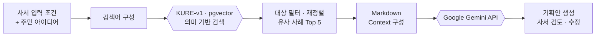
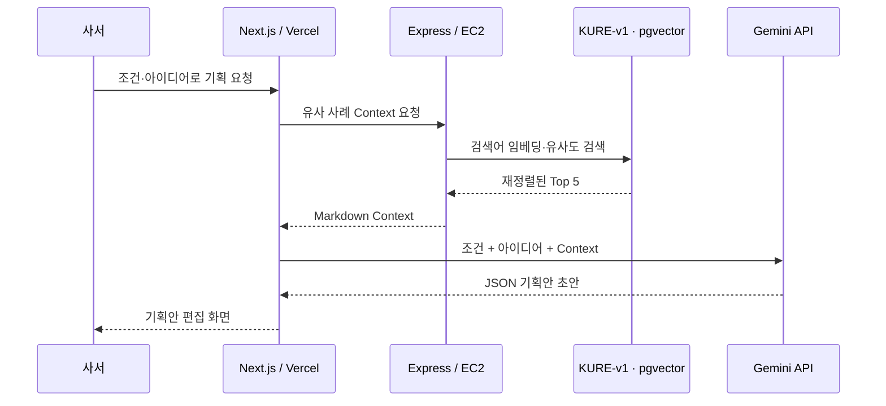

# MOIRA Studio AI 기획 과정

## 1. 기능 목적

MOIRA Studio는 사서가 입력한 운영 조건과 주민 아이디어를 바탕으로 도서관 프로그램 기획안 초안을 만듭니다. Gemini가 일반적인 내용만 생성하지 않도록, 먼저 기존 프로그램 중 의미가 가까운 사례를 검색하고 이를 참고자료로 함께 전달합니다.

핵심 흐름은 다음과 같습니다.



## 2. 의미 기반 검색을 사용한 이유

도서관 프로그램은 같은 주제라도 제목과 표현이 다양합니다. 예를 들어 `초등 과학 실험`, `어린이 탐구 교실`, `생활 속 과학 놀이터`는 단어가 정확히 일치하지 않아도 내용이 유사할 수 있습니다.

따라서 제목의 키워드 일치만 확인하지 않고, 검색어와 프로그램 설명을 KURE-v1 벡터로 변환하여 **문장의 의미가 가까운 사례**를 찾도록 구성했습니다. 검색 결과는 기획안을 대신 작성하는 답안이 아니라, Gemini가 프로그램의 구성과 활동 아이디어를 참고하는 근거로 사용합니다.

## 3. 입력 정보와 검색어 구성

기획은 다음 두 방식 중 하나로 시작할 수 있습니다.

- 사서가 프로그램 아이디어를 직접 입력
- 주민이 등록한 지역 의제를 선택

선택한 주민 의제가 있으면 제목, 내용과 태그를 사서의 메모와 합칩니다. 검색 조건 중 **대상**과 **분야**는 검색어에 포함하며, 대상은 검색 후보를 줄이는 필터로도 사용합니다.

운영 기간, 회차, 예산과 장소는 새 프로그램이 지켜야 할 생성 조건이므로 유사 사례 검색 조건으로 사용하지 않고 Gemini 기획 단계에서 반영합니다.

```text
검색어 = 대상 + 분야 + 사서 메모 + 주민 의제 제목·내용·태그
```

## 4. pgvector 유사 사례 검색

Vercel의 Next.js Route Handler가 검색어와 대상 필터를 AWS EC2의 Express API로 전달합니다. Express는 Python 검색 모듈을 실행하고 다음 순서로 후보를 찾습니다.

1. 검색어를 KURE-v1의 1024차원 벡터로 변환합니다.
2. PostgreSQL pgvector에서 코사인 거리가 가까운 프로그램 후보를 조회합니다.
3. 대상 조건과 맞지 않는 후보를 제외합니다.
4. 의미 유사도에 대상 적합도와 주제·활동 개념 충족도를 반영하여 재정렬합니다.
5. 최소 점수와 상대 유사도 기준을 통과한 결과만 남깁니다.
6. 이름과 대상이 유사한 같은 시리즈의 프로그램이 반복되지 않도록 대표 사례만 선택합니다.

이 재정렬 과정은 파일 기반 파일럿에서 사용한 대상·개념·임계값 정책을 pgvector 검색에도 동일하게 적용한 것입니다. 저장소에는 파일럿과 pgvector의 평가 질의 결과가 같은지 확인하는 검증 명령도 포함되어 있습니다.

## 5. Top 5 선정

현재 MOIRA Studio는 재정렬 결과에서 최대 5개의 유사 사례를 사용합니다.

- 한 사례에 편중되지 않고 여러 프로그램의 공통 구조를 참고할 수 있습니다.
- Gemini에 전달되는 Context가 지나치게 길어지는 것을 제한합니다.
- 프로그램별 소개, 운영정보와 회차 내용을 함께 전달할 수 있는 범위로 관리합니다.

다만 파일럿 검증은 **기존 파일 검색과 pgvector 검색의 Top 5 결과가 일치하는지** 확인한 것입니다. `Top 3`, `Top 5`, `Top 10`을 비교하여 5개가 가장 정확하다고 입증한 별도 실험은 아니며, Top 5는 현재 서비스의 운영 설정입니다.

## 6. Markdown Context 구성

검색 결과는 Gemini에 바로 개별 객체로 전달하지 않고, 읽기 쉬운 하나의 Markdown 참고자료로 구성합니다.

각 사례에는 다음 정보가 포함됩니다.

- 프로그램명과 대상
- 운영 도서관
- 교육 기간·시간과 모집 인원
- 프로그램 소개와 목표
- 의미 유사도, 개념 충족률과 대상 적합도
- 원문에 존재하는 회차별 활동 내용

회차 정보가 없는 사례에는 소개까지만 참고할 수 있다고 표시합니다. 또한 다음 사용 원칙을 Context에 함께 넣습니다.

- 참고 사례의 문장을 그대로 복사하지 않습니다.
- 여러 사례의 공통 구조를 종합해 새로운 활동으로 구성합니다.
- 참고자료에 없는 회차 내용을 기존 사례의 사실처럼 만들지 않습니다.
- 기존 프로그램의 날짜와 모집 인원을 새 기획 조건으로 복사하지 않습니다.

Markdown은 최대 30,000자로 제한해 지나치게 긴 참고자료가 Gemini 요청에 포함되지 않도록 합니다.

## 7. Gemini 기획안 생성

최종 프롬프트는 다음 정보를 결합합니다.

```text
사서의 기획 메모
+ 주민 의제
+ 사서가 선택한 운영 조건
+ 유사 프로그램 Top 5 Markdown
+ 작성 규칙과 반환 JSON 형식
```

Gemini에는 일반 문장이 아니라 정해진 JSON 형식으로 응답하도록 요청합니다. 반환값을 서비스의 기획안 구조로 변환하여 프로그램명, 기획 의도, 대상, 운영 내용과 회차별 계획 등의 항목으로 화면에 표시합니다. 근거가 부족한 사실형 항목은 임의로 채우지 않고 `미정`으로 남기도록 안내합니다.

생성된 내용은 최종 결과가 아니라 **사서가 검토하고 수정하는 초안**입니다. 사서는 전체를 다시 생성하지 않고 필요한 항목이나 선택한 문장만 수정할 수 있습니다. 항목 수정 요청에는 기존 유사 사례 Markdown을 다시 보내지 않아 호출 비용과 입력 길이를 줄입니다.

## 8. 요청 경로



브라우저가 EC2와 Gemini를 직접 호출하지 않고 Next.js Route Handler가 서버 간 요청을 처리합니다. 따라서 백엔드 배포 주소와 Gemini API Key를 브라우저에 노출하지 않습니다.

## 9. 실패 처리

유사 사례는 기획안의 근거이므로 검색에 실패했을 때 참고자료 없이 Gemini만 호출하지 않습니다.

- 검색어가 비어 있으면 요청을 중단합니다.
- 백엔드 연결 실패와 90초 검색 시간 초과를 구분하여 안내합니다.
- 검색 결과의 Markdown이 비어 있으면 생성을 중단합니다.
- Gemini 호출 또는 JSON 해석에 실패하면 기획안 생성 실패로 처리합니다.
- 내부 주소와 상세 오류는 서버 로그에만 남기고 사용자 화면에는 노출하지 않습니다.

## 10. 주요 기술

| 구분 | 기술 | 역할 |
| --- | --- | --- |
| 화면·BFF | Next.js Route Handler | 사용자 입력 처리, 백엔드 검색과 Gemini 호출 연결 |
| 검색 API | Express, TypeScript | Studio Context API와 Python 검색 모듈 실행 |
| 질의 임베딩 | Python, Sentence Transformers, KURE-v1 | 검색어의 1024차원 벡터 생성 |
| 벡터 검색 | PostgreSQL, pgvector | 프로그램 검색 프로필의 코사인 유사도 계산 |
| 후보 선정 | Python | 대상 필터, 개념 재정렬, 임계값과 시리즈 중복 제거 |
| 기획안 생성 | Google Gemini API | 입력 조건과 유사 사례를 반영한 JSON 기획안 생성 |

## 11. 전체 과정 요약

> MOIRA Studio는 Gemini가 기존 사례를 직접 찾도록 맡기지 않습니다. 먼저 백엔드가 KURE-v1과 pgvector로 유사 사례를 검색하고, 검증된 재정렬 정책으로 선정한 Top 5를 Markdown Context로 구성한 뒤 Gemini에 전달합니다.
