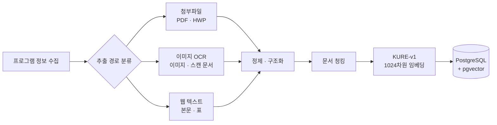

# 프로그램 사례 데이터 구축

## 1. 구축 목적

MOIRA Studio는 사서가 새로운 프로그램을 기획할 때 기존 사례를 참고할 수 있도록 지원합니다. 단순한 제목·키워드 검색은 표현이 다르면 내용이 비슷한 프로그램을 찾기 어렵기 때문에, 프로그램의 **의미를 벡터로 변환하여 비교하는 방식**을 선택했습니다.

이를 위해 공개된 도서관 프로그램 정보를 수집하고, 검색 가능한 문서로 정제한 뒤 KURE-v1 임베딩과 함께 PostgreSQL에 저장했습니다.

## 2. 데이터 수집

수집 대상은 [금정구 공공예약 서비스](https://www.geumjeong.go.kr/booking/index.geumj)의 작은도서관 프로그램 목록과 상세 페이지입니다.

- 목록 페이지를 순회하며 프로그램 식별자와 상세 페이지 주소를 수집합니다.
- 각 상세 페이지에서 제목, 대상, 운영 기간, 신청 정보, 본문, 표, 이미지 및 첨부파일 정보를 분리합니다.
- HTML 분석에는 `Cheerio`를 사용하며, 상대 주소는 원래 사이트를 기준으로 절대 주소로 변환합니다.
- 수집 실패와 중복 식별자는 결과에 별도로 기록하여 누락 여부를 확인합니다.

데이터는 특정 시점의 공개 정보를 바탕으로 구축되므로, 다시 수집할 때 전체 건수와 첨부파일 분포가 달라질 수 있습니다.

## 3. 형식별 텍스트 추출

프로그램 설명은 웹 본문뿐 아니라 표, PDF, HWP, 이미지에 나뉘어 있어 형식별 추출 경로를 구성했습니다.

| 데이터 형식 | 처리 방식 | 사용 도구 |
| --- | --- | --- |
| 웹 본문 | 문단과 줄바꿈을 유지하며 텍스트 추출 | Cheerio |
| HTML 표 | 행·열과 병합 셀 정보를 보존하여 구조화 | Cheerio |
| PDF | 페이지별 텍스트를 추출하고 텍스트가 부족한 페이지를 OCR 대상으로 분류 | pdfjs-dist |
| HWP | Markdown과 HTML table 형태로 변환한 뒤 본문과 표를 정리 | Kordoc 4.2.7 |
| 이미지·스캔 문서 | 이미지 전처리 후 문자와 위치·신뢰도 정보를 추출 | Sharp, CLOVA OCR General |

HWPX 파일을 식별하는 경로는 분리되어 있지만, 데이터 구축 당시 수집본에는 HWPX가 없어 실제 변환 대상에는 포함되지 않았습니다.

### OCR을 별도로 사용한 이유

PDF나 HWP는 내부에 텍스트가 있으면 문서 파서가 더 정확하고 빠릅니다. 반면 안내 포스터나 스캔 PDF에는 추출 가능한 텍스트가 없으므로 CLOVA OCR을 보완 수단으로 사용했습니다.

- PDF 페이지의 글자 수를 기준으로 일반 텍스트 페이지와 OCR 후보 페이지를 구분합니다.
- 같은 이미지 체크섬은 한 번만 호출하고 OCR 결과를 재사용합니다.
- OCR 신뢰도가 낮거나 표의 셀 관계가 불명확한 결과는 자동 게시하지 않고 검수 대상으로 분류합니다.

## 4. 정제와 구조화

추출 결과를 그대로 합치면 기본정보와 첨부파일의 내용이 반복되거나, 안내 문구가 프로그램 내용에 섞일 수 있습니다. 따라서 다음 원칙으로 데이터를 정리했습니다.

- 제목, 대상, 기간, 장소, 비용 등 기본정보와 본문을 분리합니다.
- 태그와 제어문자, 불필요한 공백을 제거합니다.
- 기본정보와 본문·첨부파일에 반복된 내용은 한 번만 남깁니다.
- 프로그램 소개, 전체 회차, 첨부파일 내용을 각각 구분합니다.
- 값이 충돌하거나 구조를 확정하기 어려운 경우 임의로 보정하지 않고 검수 대상으로 남깁니다.
- 수강신청자 목록 등 개인정보가 포함될 가능성이 있는 영역은 수집·검색 문서에서 제외합니다.

## 5. 문서 청킹

긴 첨부 문서를 한 번에 임베딩하면 입력 길이 제한에 걸리거나 여러 주제가 하나의 벡터에 섞일 수 있습니다. 이를 줄이기 위해 검색 문서를 다음 유형으로 나눕니다.

| 청크 유형 | 포함 내용 |
| --- | --- |
| `CORE` | 프로그램명, 대상 및 핵심 소개 |
| `SESSIONS` | 전체 회차와 활동 내용 |
| `ATTACHMENT` | PDF·HWP·이미지에서 추출한 내용 |

첨부 문서는 문단과 문장 경계를 우선해 약 1,500자 단위로 나누고, 최대 2,000자를 넘지 않도록 제한합니다. 분할 경계에서 의미가 끊기는 것을 줄이기 위해 최대 150자의 앞부분을 다음 청크에 중복합니다. 각 청크에는 프로그램명, 대상, 문서 유형과 첨부파일명을 함께 넣어 검색 결과만 보더라도 출처를 알 수 있게 했습니다.

## 6. KURE-v1 임베딩

한국어로 작성된 프로그램 설명과 사용자 검색어의 의미를 같은 공간에서 비교하기 위해 `nlpai-lab/KURE-v1`을 사용했습니다.

- 프로그램 청크와 검색어를 각각 **1024차원 벡터**로 변환합니다.
- 벡터는 L2 정규화하여 코사인 유사도 비교에 사용합니다.
- 모델과 revision을 고정하여 실행 환경에 따른 결과 변화를 줄입니다.
- 내용의 체크섬과 모델 정보가 같은 임베딩은 다시 생성하지 않습니다.

키워드가 정확히 일치하지 않더라도 문맥이 비슷한 사례를 찾을 수 있다는 점이 의미 기반 검색을 선택한 핵심 이유입니다.

## 7. PostgreSQL·pgvector 저장

정제된 프로그램 정보와 청크는 관계형 데이터로 PostgreSQL에 저장하고, 임베딩은 pgvector의 `VECTOR(1024)` 컬럼에 저장합니다.

검색할 때는 사용자 질의도 KURE-v1으로 임베딩한 뒤, pgvector의 코사인 거리 연산으로 가까운 후보를 조회합니다. 임베딩 상태, 모델 revision, 차원과 콘텐츠 체크섬이 현재 문서와 일치하는 데이터만 검색 대상으로 사용합니다.

이 구성은 다음 장점이 있습니다.

- 서비스 데이터와 벡터를 하나의 PostgreSQL에서 일관되게 관리할 수 있습니다.
- 프로그램·문서·청크의 관계를 유지하면서 유사 사례를 추적할 수 있습니다.
- 문서가 변경되었을 때 해당 임베딩만 선별적으로 갱신할 수 있습니다.

## 8. 주요 기술

| 구분 | 기술 | 역할 |
| --- | --- | --- |
| 수집 | Node.js, TypeScript, Cheerio | 목록·상세 페이지 및 HTML 구조 수집 |
| PDF | pdfjs-dist | 페이지별 텍스트 추출과 OCR 후보 판별 |
| HWP | Kordoc | Markdown·HTML table 기반 텍스트 추출 |
| OCR | Sharp, CLOVA OCR General | 이미지 전처리와 이미지·스캔 문서 인식 |
| 임베딩 | Python, Sentence Transformers, KURE-v1 | 한국어 문서와 질의의 1024차원 벡터 생성 |
| 저장·검색 | PostgreSQL, pgvector | 서비스 데이터·임베딩 저장 및 코사인 유사도 검색 |

## 9. 다음 단계

저장된 프로그램 사례는 MOIRA Studio에서 사서의 입력 조건과 주민 아이디어에 가까운 사례를 찾는 데 사용됩니다. 검색된 상위 사례를 Gemini에 어떻게 전달하는지는 `MOIRA Studio AI 기획 과정` 문서에서 설명합니다.
